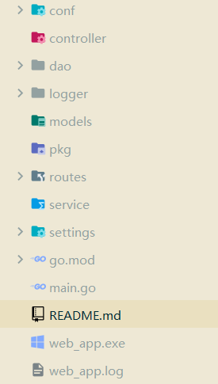

## Go Web项目通用脚手架
### 一、简介

web_app是一个基于go语言和gin框架搭建的go web开发脚手架。用以在开发web项目的时候可以快速进入到需求开发阶段，帮助您省略前期环境以及配置的搭建环节。

- conf ---> 配置文件
- controller ---> 处理请求
- dao ---> 数据交互
- logger ---> 日志配置
- models ---> 数据模型
- pkg ---> 第三方库
- routes ---> 路由配置
- service ---> 业务逻辑
- settings ---> viper配置初始化
- main ---> 入口(进行基本初始化)

### 二、功能概览

- dao层已具备主流关系型数据库MySQL的初始化(注：**sqlx实现**)以及非关系型数据库redis的初始化(注：基于**go-redis**第三方库)
- 采用viper进行核心配置管理，采用watch模式，支持线上配置修改
- 采用zap日志库进行日志的记录，已经处理为全局路由请放心用zap.L()进行日志对象的获取和使用
- 基于gin框架处理路由注册
- 脚手架具备优雅关机功能